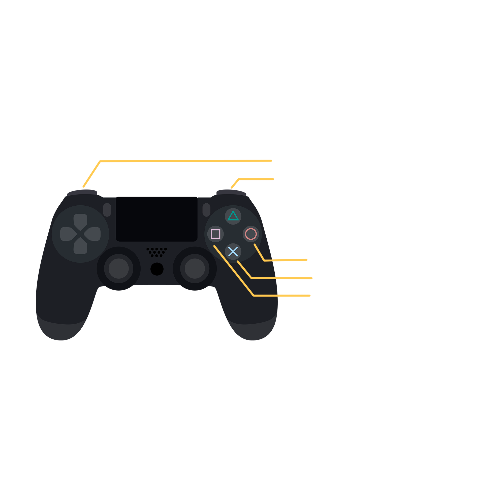

# LaRVerinto
Proyecto desarrollado para la asignatura Interfaces Inteligentes en la Universidad de La Laguna. Curso 2021-2022.
## Autores
* Daniel del Castillo de la Rosa
* Javier Correa Marichal
* Alejandro Peraza González
* Nerea Rodríguez Hernández
## Cuestiones importantes para el uso.
Una vez iniciada la aplicación el usuario se encontrará en la escena inicial del juego. Esta escena le servirá para identificar los controles del juego:

 {width: 5px; height: 5px}

Así mismo, y haciendo uso de la retícula, el usuario tiene dos opciones: *Jugar* o *Salir*. Una vez accionado el botón de *Jugar*, el usuario se teletransporta a la escena principal de juego.

## Hitos de programación
## Aspectos a destacar de la aplicación
Especificar si se han incluido sensores de los que se han trabajado en interfaces multimodales.
## Gif animado de ejecución
## Organización del proyecto
## Experiencia en VR

