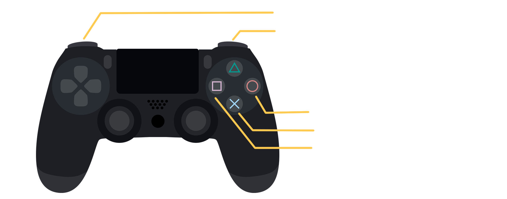

# **LaRVerinto**
Proyecto desarrollado para la asignatura Interfaces Inteligentes en la Universidad de La Laguna. Curso 2021-2022.
## Autores
* Daniel del Castillo de la Rosa
* Javier Correa Marichal
* Alejandro Peraza González
* Nerea Rodríguez Hernández
## **Cuestiones importantes para el uso.**
Una vez iniciada la aplicación el usuario se encontrará en la escena inicial del juego. Esta escena le servirá para identificar los controles del juego:

Así mismo, y haciendo uso de la retícula, el usuario tiene dos opciones: *Jugar* o *Salir*. 

Una vez accionado el botón de *Jugar*, el usuario se teletransporta a la escena principal de juego. En esta escena el usuario se encuentra en un laberinto autogenerado, se desplazará haciendo uno de los controles de un mando PS4. Cuando el usuario consiga llegar a la salida, colocándose debidamente, se teletrasportará hasta la escena final.

En esta escena final se despliega un botón para que el usuario pueda volver a la escena inicial del juego y pueda repetir la experiencia en un nuevo laberinto generado proceduralmente. 

## **Hitos de programación.**
A continuación se muestra en la tabla los hitos de programación que se han seguido y conseguido en el presente proyecto:
|  Hito                                         |                  Descripción                                                                                          |
|-----------------------------------------------|-----------------------------------------------------------------------------------------------------------------------|
| Funcionamiento en Realidad virtual            | Implementación de un entorno en realidad virtual para Android (.apk)                                                  |
| Generación de laberinto procedural       | Implementación de un camino y paredes, que simulen un laberinto, de manera procedural                            |
| Marcador de teletransporte | Implementación de un marcador que permite al usuario saber a dónde se va a teletransportar |
| Movimiento de usuario mediante teletransporte | Implementación de saltos de lugar del jugador |
| Marcas orientativas                           | Implementación de marcas orientativas en las paredes (cruz roja) y en el suelo (brújula que indica sur y norte magnéticos)       |
| Escenario inicial                             | Implementación de un escenario inicial en el que el usuario elige cuándo comenzar el juego y se le dan a conocer los controles del mismo                             |
| Concideraciones de experiencia usuario        | En la implementación del diseño se han tenido en cuenta las distintas consideraciones UX explicadas en la asignatura |
| Escenario final                               | Implementación de un escenario final donde el usuario se encuentre ganador y un botón le permita volver al escenario inicial                                         |

## **Aspectos a destacar de la aplicación.**

Lo que define este proyecto es la generación procedural del laberinto, por lo tanto este es el aspecto más importante. Hacer que el laberinto sea distinto en cada partida es vital para que la jugabilidad no decaiga considerablemente tras la primera partida.

Otro aspecto importante a destacar de la aplicación y que ha significa una gran parte del tiempo del desarrollo del proyecto es la implementación del movimiento del usuario mediante teletransporte. No solo fue necesario todo aquello que sería necesario para mover a cualquier personaje, sino que también fue necesario hacer cálculos para que el marcador del teletransporte se moviese de acuerdo a donde el usuario estaba mirando. Esto era complejo debido a que la cámara y el marcador de telentransporte no comparten su rotación ni su posición.

Uno de los principales aspectos que destacar de la aplicación y que hace referencia a lo que se ha trabajado en la asignatura en interfaces multimodales, es el componente Brújula. Este objeto proporciona orientación al usuario indicándole la dirección Norte-Sur. Esto permite al usuario orientarse dentro del laberinto, ya que el Norte apunta siempre al Norte magnético en la realidad, lo que se traduce en apuntar consistenemente en la misma dirección dentro del mundo del juego.

## **Ejecución de la aplicación.**
Video demostrativo de la aplicación desarrollada en el presente proyecto:

## **Organización del proyecto.**
A lo largo del proyecto se han desarrollado distintas reuniones a través de la plataforma *Discord*, donde nos hemos reunido todos los componentes del equipo de trabajo. El primer hito a desarrollar consistía en el funcionamiento de una APK en Realidad Aumentada, mientras unos intentaban trabajar en la implementación en Unity otras buscaban las distintas maneras de solventar los problemas que se iban encontrando. Tras conseguir generar un escenario en una APK en realidad aumentada, el equipo se dividiría en parejas para desarrollar la generación procedural del laberinto y el movimiento mediante teletransporte. Cada cierto tiempo se hacía una reunión con todos los miembros del equipo para ver el estado del proyecto y discutir cuáles eran los siguientes pasos.

## **Experiencia en Realidad Virtual**
A continuación se listan los distintos aspectos que se han tenido en cuenta en la *APK* y cómo se han solventado en la misma:
* Papel del suelo. Para evitar que el usuario se maree debido a la pérdida de percepción de la realidad con la relación cielo-suelo, los escenarios del laberinto en sí mismo y el escenario de victoria, se encuentran abiertos y el usuario podrá mirar el cielo mientras se desplaza. Por otro lado, a pesar de que la escena inicial está cerrada, el jugador no se mueve así que no lo consideramos un inconveniente.
  
* Atmósfera. El usuario podrá determinar la profundidad y la distancia a la que se encuentra un objeto ya que se ha añadido un desvanecimiento gradual al entorno. Con esto se consigue crear un entorno virtual escalado y una experiencia más natural.
  
* Caracterísitcas del terreno. Aunque no se cuenta con un entorno abierto, el camino del laberinto permite el movimiento de un lugar a otro. El usuario sabrá que está en el centro del laberinto cuando encuentre un *pozo* (permite colisión) y las paredes del laberinto jugaran el papel de barrera, un tipo específico de obstáculo, que bloquea la visión y el movimiento del mismo.
  
* Introducción del usuario mediante paisajes sonoros. Cada vez que se realice un cambio de escenario, se genera una suave introducción al nuevo escenario haciendo aparecer primero el sonido contextual del lugar y luego la imagen. De esta forma el usuario, no se desorienta con lo cambios de posición.
  
* Guiar al usuario con objetos. El laberito puede ser un escenario donde el usuario se desoriente con facilidad, por lo que se ha permitido que coloque unas marcas rojas en la pared para identificar los caminos por los que ha pasado. Además, puede colocar en el suelo una brújula que señaliza el norte y el sur, con esto el usuario puede determinar su dirección.
  
* Retícula contextual. El usuario sabe con qué objetos puede interactuar gracias a la retícula. Una retícula de radio mínimo significa un estado inactivo. Cuando un usuario pone la retícula sobre un objeto con el que puede interactuar, la retícula se expande indicándolo. Hemos limitado la distancia en la que la retícula detecta objetos interactuables para que el usuario sepa cuál es su alcance a la hora de poner marcas.

* Objetos interactivos. No todos los objetos que aparecen en la escena son objetos interactivos, por lo que el usuario los identifica utilizando la retícula contextual anteriormente nombrada.
